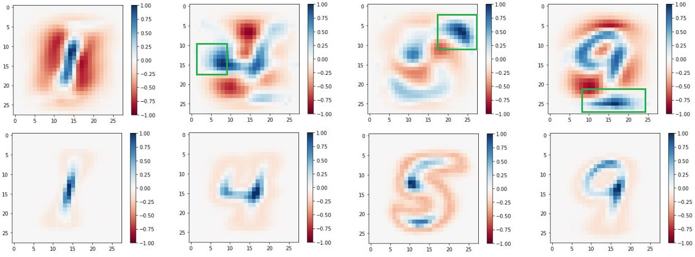
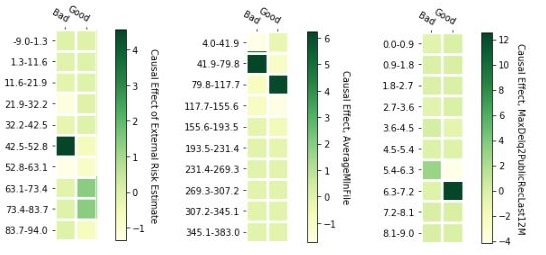

# Neural_Causal_Modelling
Graphical Modelling of Neural Networks for determining causality between input, intermediate and output variables

## Background
As machine learning models take over real world tasks, there is an increasing requirement for being able to 
interpret why the model predicts what it does.
This repository implements a framework to get causal interpretations of an Artificial Neuron Network for determining neuron and layer level causalit.

## Workflow 

   

## Results
### MNIST
To demonstrate how our algorithm can seperate causal variables from spurious and non causal variables, we conduct a study comparing causal variables predicted by our algorithm with the Pearson Correlation Coefficient of each input variable with the output, as shown in \ref{MNIST}. We also verify this numerically via an ablation study. 

### HELOC Dataset
The [HELOC Dataset](https://community.fico.com/s/explainable-machine-learning-challenge?tabset-3158a=2) (Home Equity Line of Credit) is an anonymized dataset provided by FICO.
The fundamental task is to predict credit risk. A simple ANN is trained for this, reaching 70% validation accuracy. Causal input variables and their ranges are found using the pipeline above.
 

Figure 1 : Causal vs Spurious Variables for MNIST           |  Figure 2: Causal Variables and ranges for HELOC
:-------------------------:|:-------------------------:
  |  
