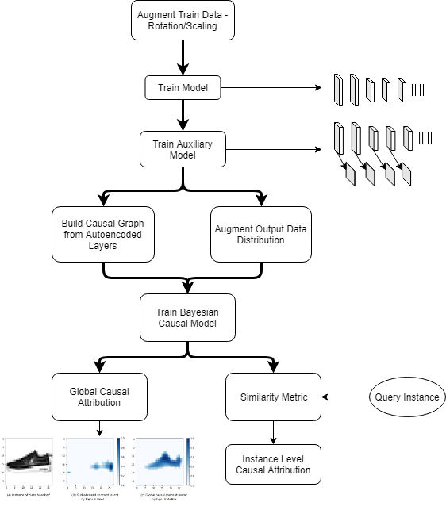

# Neural_Causal_Modelling
Graphical Modelling of Neural Networks for determining causality between input, intermediate and output variables

## Background
As machine learning models take over real world tasks, there is an increasing requirement for being able to 
interpret why the model predicts what it does.
This repository implements a framework to get causal interpretations of an Artificial Neuron Network for determining neuron and layer level causalit.

## Workflow 
 

